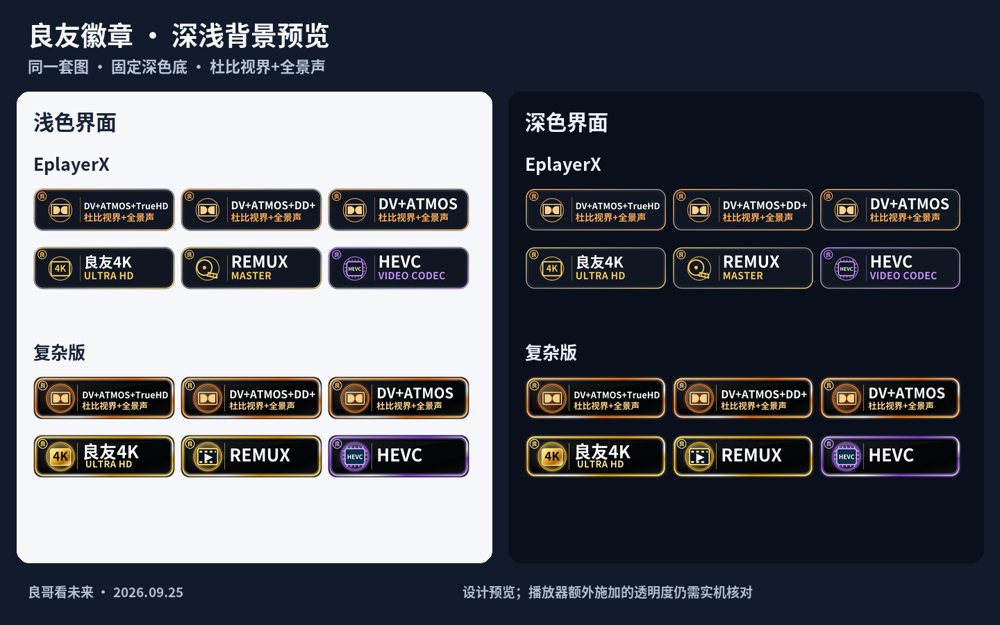

# 良友徽章 · LiangYou Media Badges

V9 · 2026-09-25 · 良哥看未来

保留双层边框和「良」字风格；修正浅色背景可读性，合并重复组合，并收紧默认匹配上下文。

## 导入

| 版本 | 启用徽章 | 正式地址 | 绕过旧配置缓存的新地址 |
| --- | --- | --- | --- |
| EplayerX · SVG | 47 枚，含 7 枚组合 | [EPX](https://raw.githubusercontent.com/MaddestAlistar/liangyou-appletv-badges/main/Badge%20LiangYou%20Ver.EPX.json) | [EPX9](https://raw.githubusercontent.com/MaddestAlistar/liangyou-appletv-badges/main/Badge%20LiangYou%20Ver.EPX9.json) |
| 复杂版 · PNG | 85 枚，含 7 枚组合 | [all](https://raw.githubusercontent.com/MaddestAlistar/liangyou-appletv-badges/main/Badge%20LiangYou%20Ver.all.json) | [all9](https://raw.githubusercontent.com/MaddestAlistar/liangyou-appletv-badges/main/Badge%20LiangYou%20Ver.all9.json) |

**替换旧徽章包，重新加载；不要与 V8 或另一套完整配置叠加导入。** V8 的 Profile 组合仍可能留在客户端已保存的旧规则中，单纯刷新图片无法删除它们。历史 EPX8 / all8 地址保留旧版本用于回退。

主配置采用严格匹配：同一候选文本必须同时含有「分辨率或视频编码」和「音频格式」。这能过滤孤立的 `TrueHD`、`DV P7`、`UHD Blu-ray` 等字段，减少它们与完整组合叠加。**信息不全的资源可能少显示、甚至没有徽章；严格匹配不能保证跨候选字段全局互斥。**

备用配置（任选一套替换，不要同时启用）：

- [EPX PNG](https://raw.githubusercontent.com/MaddestAlistar/liangyou-appletv-badges/main/Badge%20LiangYou%20Ver.EPX.PNG.json)：同样式、同严格规则，换用 PNG 解码。
- 宽松匹配：[EPX.Relaxed](https://raw.githubusercontent.com/MaddestAlistar/liangyou-appletv-badges/main/Badge%20LiangYou%20Ver.EPX.Relaxed.json) / [all.Relaxed](https://raw.githubusercontent.com/MaddestAlistar/liangyou-appletv-badges/main/Badge%20LiangYou%20Ver.all.Relaxed.json)。不要求完整上下文，适用于更新后徽章过少的客户端；分字段合并时更容易重复。
- [复杂版仅单项](https://raw.githubusercontent.com/MaddestAlistar/liangyou-appletv-badges/main/Badge%20LiangYou%20Ver.all.Single.json)：78 枚，关闭组合，保留严格上下文和分类优先级。
- [尺寸诊断](https://raw.githubusercontent.com/MaddestAlistar/liangyou-appletv-badges/main/Badge%20LiangYou%20Diagnostic.json)：临时显示一张固定图片，比较不同卡片容器的缩放。

## 深浅背景预览



[EplayerX 全套](previews/EPX-v9.png) · [复杂版全套](previews/ALL-v9.png) · [组合全套](previews/Combos-v9.png)

EPX 的透明底白字已改为深色实体底；复杂版保留原深色渐变，并补充深色外轮廓。文字区域不会再透出白色页面背景。所有 SVG 为 320×96，PNG 为 960×288，文字仍为矢量轮廓。若客户端额外给整张图片加透明度、模板着色或缩放，需要在客户端排查；图片无法关闭这些 UI 效果。

配色沿用金／紫／蓝／橘：高阶项目、杜比单项及版本标识为金色，次级紫色，常规蓝色，组合与特殊项目橘色。颜色和下面的优先级是本套展示策略，不是所有格式的绝对画质排名。

## 组合与分类优先级

同一输入内，组合先于单项排列；命中最高优先级组合后不显示较低组合及单独音频格式。具有 DV 的组合还排除独立 DV / Profile / HDR 徽章。

| 组合优先级 | 所需标签 | 第二行 |
| --- | --- | --- |
| 1 | DV + Atmos + TrueHD | 杜比视界+全景声 |
| 2 | DV + Atmos + DD+，无 TrueHD | 杜比视界+全景声 |
| 3 | DV + Atmos，未明确上述编码 | 杜比视界+全景声 |
| 4 | DV + TrueHD，无 Atmos | 杜比视界 · 无损音频 |
| 5 | Atmos + TrueHD，无 DV | 杜比全景声 · TRUEHD |
| 6 | Atmos + DD+，无 DV / TrueHD | 杜比全景声 · E-AC-3 |
| 7 | DTS:X + DTS-HD MA，未命中以上组合 | 沉浸音频 · MASTER AUDIO |

DV + Atmos 系列的中文统一为 **杜比视界+全景声**，TrueHD / DD+ 移到第一行。P5 / P7 / P8 不再各复制一组组合，避免「P7 组合 + 通用组合」并排；单独 DV 仍可在复杂版细分 Profile。复杂版从 97 枚合并为 85 枚，常规格式没有删减。

其他分类在同一输入内只选优先项，例如：

- 片源：REMUX → UHD Blu-ray → Blu-ray → WEB-DL → WEBRip → HDTV → DVDRip。
- 画面：DV → HDR10+ → HDR10 → HLG → HDR → SDR。
- 分辨率：4K → 1080P → 720P → 576P → 480P。
- 声道：7.1 → 6.1 → 5.1 → 2.0 → 1.0。
- 位深、IMAX、帧率及视频编码也执行分类优先；版本标识和明确音轨语言可以保留多个。

徽章表示输入中的标签，不证明当前选中音轨、实际输出格式或原盘完整性。多音轨、多媒体版本被混在同一字符串中时，展示的优先项不等于当前播放轨道。组合顺序已放到 JSON 数组前面，客户端仍可能自行按分组、数量上限或 UI 逻辑排序。

## 为什么仍不能承诺所有播放器只显示最高一枚

部分播放器分别匹配文件名、媒体字段，再把命中结果合并。一个完整文件名可能命中 `Atmos + TrueHD`，另一个包含 DV 的完整候选又命中 `DV + Atmos + TrueHD`；后者不能通过自己的正则撤销前者。

V9 已测试这种剩余反例，未将它隐藏或写成“全部去重成功”。真正的全局互斥需要播放器先整理同一个 MediaSource 的信息，或在汇总后执行选择逻辑。仓库提供 [选择器参考实现](tools/select_badges.py)，**仅供客户端集成；导入 JSON 不会自动运行它**。

[本次截图问题与兼容性说明](reports/COMPATIBILITY-v9.md) · [V8 历史核查](reports/COMPATIBILITY-v8.md)

## 已有识别能力与校正

两套均有 WEBRip / UHD Blu-ray / HDTV / SDR / HDR、IMAX / IMAX Enhanced、10 / 8 bit、DD+ / EAC3、DD / AC3、PCM / LPCM、OPUS、1.0 / 2.0 / 6.1 等。复杂版另有 DV Profile、3D、480P / 576P、DVDRip、老编码、MP3、高帧率、平台、版本标识及音轨语言。

延续 V8 的纠错：普通 EAC3 不等于 Atmos；Main10 不单独推断 HEVC；MPEG4 不单独推断 AVC；HDR10+ 加号边界正确；不将 L5.1 / Level 5.1 当作声道；不从 6ch / 8ch 推断布局；没有 HDR 标签不自动判为 SDR。CAM、SeaDex、True-Hue 仍未启用。

## 构建与验证

```sh
python tools/badge_rules.py
python tools/render_badges.py --font /path/to/NotoSansCJKsc-Bold.otf
python tools/preview_themes.py --font /path/to/NotoSansCJKsc-Bold.otf
python tools/test_badges.py
python tools/check_assets.py
```

图片生成需要 Python 3.12+、Pillow、fontTools、lxml、Inkscape 和 Noto Sans CJK SC Bold；匹配测试需要 ICU 和 JDK 17+。

536 个场景在 Python、ICU 74、Java 17 中完成 1,608 次断言，涵盖宽松和正式严格规则。另有 4 个字段集合测试（包括仍会重复的反例和低信息不显示的代价），以及 133 份 SVG / 133 份 PNG 的尺寸、透明度和深浅背景合成验证。测试并非 EplayerX / CapyPlayer 实机认证，也没有访问用户服务器。

[规则验证](reports/validation-v9.json) · [图片验证](reports/assets-validation-v9.json)

## V9 资料卡 / 播放页一致性检查

已对 EPX9 与 Ver.all9 的核心徽章规则做一致性检查和统一：

- 分辨率：4K > 1080P > 720P > 576P > 480P，避免同一条文本重复命中多个分辨率。
- Dolby：DV+Atmos 最高；Dolby Vision / Atmos 单独回退；TrueHD 始终独立。
- Atmos 兜底：当缺少明确 Atmos 文本，但同时存在 Dolby Vision + TrueHD 7.1 + 4K/UHD/REMUX 等高规格线索时，允许推断 DV+Atmos。
- DD+ / DD：遇到 Atmos / TrueHD / 更高 Dolby 条件时降低重复显示；DD 在 Dolby Vision 出现时不显示。
- HDR：Dolby Vision > HDR10+ > HDR10 > HLG > HDR；SDR 与 HDR/DV 互斥。
- IMAX：IMAX Enhanced 优先于普通 IMAX。
- 位深：10 BIT 优先于 8 BIT。
- 声道：7.1 > 6.1 > 5.1 > 2.0 > 1.0；不再用 8ch/6ch 粗暴推断，避免 L7.1 / L5.1 等 Profile 误判。
- HEVC：保留 HEVC/H.265/x265/hvc1/hev1；播放页缺 codec 时使用 Main10、DV、UHD Blu-ray、4K REMUX 做保守兜底，并排除明确 AV1/VP9/AVC。
- Source：REMUX 优先，UHD Blu-ray / Blu-ray 做互斥，WEB-DL / WEBRip / HDTV 保持直接匹配。
- DTS 系列维持当前规则，不再调整，因为实测重复问题已经解决。
- 平台 / Edition / 语言类徽章主要依赖文件名或资源标题；如果播放器播放页没有继续传这些字段，JSON 无法强制做到与资料卡完全一致。
