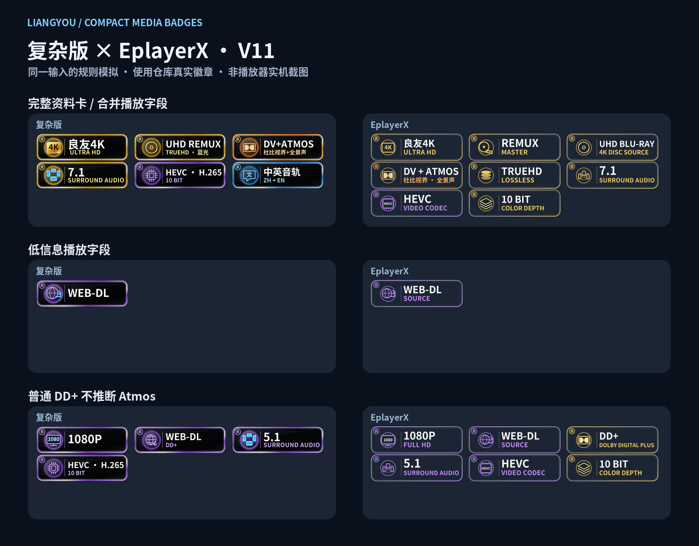

# 良友徽章 · LiangYou Media Badges

V11 · 2026-09-25 · 良哥看未来

复杂版沿用原来的发光边框、图标和「良」字角标，片源与音频、编码与位深、音轨语言合并显示。EplayerX 保留简洁造型。两版共用识别逻辑，**良友 4K 最前，7.1／5.1 等声道在 HEVC 前面**。

## 导入地址

| 版本 | 新导入地址 | 内容 |
| --- | --- | --- |
| 复杂版 | [all11.json](https://raw.githubusercontent.com/MaddestAlistar/liangyou-appletv-badges/main/Badge%20LiangYou%20Ver.all11.json) | 155 条候选规则，PNG，含组合徽章 |
| EplayerX | [EPX11.json](https://raw.githubusercontent.com/MaddestAlistar/liangyou-appletv-badges/main/Badge%20LiangYou%20Ver.EPX11.json) | 41 条候选规则，SVG，简洁造型 |
| EplayerX PNG 备用 | [EPX.PNG.json](https://raw.githubusercontent.com/MaddestAlistar/liangyou-appletv-badges/main/Badge%20LiangYou%20Ver.EPX.PNG.json) | 与 EplayerX 相同规则，完整 PNG 图片 |
| 复杂版单项备用 | [all.Single.json](https://raw.githubusercontent.com/MaddestAlistar/liangyou-appletv-badges/main/Badge%20LiangYou%20Ver.all.Single.json) | 76 条规则，保留 DV+Atmos，其余以单项显示 |

替换原徽章包并重新加载，使用所选版本的一条地址即可。新地址便于绕过旧配置缓存；同时启用多个包可能重复显示。

旧地址也已同步：复杂版 `all`、`all9`、`all10`、`all.Relaxed` 与 `all11` 完全相同；EplayerX 的 `EPX`、`EPX9`、`EPX10.themefix`、`EPX.Relaxed` 与 `EPX11` 完全相同。编号地址在本仓库是兼容入口；历史快照请使用 Git 提交链接。

## 顺序与预览

**良友 4K／其他分辨率 → REMUX 原盘组 → 普通片源 → 杜比与画面 → 剩余音频格式 → 版本与平台 → 7.1／6.1／5.1／Stereo／Mono → 编码与位深／帧率 → 音轨语言。**

规则数组与分组数组均采用这个顺序；播放器最终排版及显示数量由客户端决定。



[复杂版组合总览](previews/Complex-Portable-v11.png) · [全部组合图形](previews/Complex-Compact-Catalogue-v10.png) · [深浅背景](previews/Complex-Portable-Themes-v11.png)

复杂版保留 55 枚片源与音频组合、12 枚编码与位深组合、11 枚多语言音轨组合，以及 3 枚配套单项图形。SVG 为 320×96，PNG 为 960×288，文字已转轮廓。候选规则不会全部同时显示。

完整输入 `2160p UHD BluRay REMUX DV TrueHD Atmos 7.1 HEVC 10bit 中文音轨 英语音轨` 显示：

**良友4K → UHD REMUX / TrueHD → DV+Atmos → 7.1 → HEVC·H.265 / 10bit → 中英音轨**，共 6 枚。

HEVC 与 H.265、AVC 与 H.264 各合为同一种编码。没有位深信息时保留编码单项；不凭空补 8bit 或 10bit。稀少、没有专用组合图形的片源与音频搭配保留两个单项。

## 本次排查与同步

V10 复杂版存在大量 `\A`／`\Z` 锚点，ECMAScript 模式下会失效；EplayerX 主地址仍是旧的严格上下文版，会漏掉独立播放字段。V11 移除这些锚点、恢复低信息单项回退，并同步全部在用入口。复杂版最长规则从 **76,292** 字符缩短到 **4,927**，主 JSON 从约 **1.56 MB** 降到 **0.40 MB**。

这复现了能造成大量徽章不显示的兼容性问题；截图本身未提供播放器真实匹配输入，不能据此确认设备端只有这一种原因。测试保留已有 `(?i)` 配置前缀，在 Node 中将其映射为 `i` 标志；未声称配置可未经导入器处理就直接交给 JavaScript `RegExp`。

| 项目 | V11 两版处理 |
| --- | --- |
| REMUX | 独立 `master-source` 高优先级组，排在普通片源前 |
| UHD Blu-ray／Blu-ray／WEB-DL | 同一输入内按优先级互斥，REMUX 与蓝光来源可以同时表达；复杂版的 UHD REMUX 徽章已经合并二者，避免再补一枚相同来源 |
| Atmos | 明确 Atmos／JOC 优先；按使用需求保留 **DV + DD+ 5.1／7.1** 的兼容推断，普通 DDP5.1、4K DDP5.1、单独 DDP7.1 不推断 Atmos |
| DD+ | Atmos 命中时让位，包括含 DD+ 的片源组合；片源本身仍保留 |
| DTS | 两版识别 `dca`、`profile=ma/xll/hra/x`；**取消仅凭 4K／DV／UHD／REMUX 推断 DTS-HD MA**，缺具体 profile 时保留 DTS |
| PCM | 识别 `A_PCM/…`、`pcm_f32le`、`pcm_s24le`、`sowt` 等明确编码；**取消仅凭解码 `sample_fmt=fltp/s16/…` 推断 PCM** |
| Mono／Stereo／环绕声道 | 支持 `1ch`、`2ch`、`channels=1/2` 等；声道排在编码前，排除视频 `Level/Profile 5.1`，不把 `channels=20` 当 2.0 |
| WEB-DL | 支持 WD、NF、AMZN、DSNP、ATVP 等来源缩写回退；明确 WEBRip 优先于平台缩写回退，明确 WEB-DL 仍优先于 WEBRip |

同时修正了 `pcm_bluray` 编码 ID 被误当作蓝光来源、`WEB-Rip` 被误当作 WEB-DL 等边界情况。EplayerX PNG 备用包补齐 41 张与当前 SVG 对应的图片。

保留的兼容推断仍有边界：DV + DD+ 5.1／7.1 不等于服务器确认了 Atmos；Main10／DV／UHD 蓝光／4K REMUX 在没有相冲突编码时可回退 HEVC；平台缩写可回退 WEB-DL。这些展示策略不证明播放设备实际输出格式，也不是画质排名。

## 资料卡与播放字段

单独传入 `4K`、`HEVC`、`WEB-DL`、`BluRay Remux`、`HDR`、`SDR`、`5.1` 等都有对应回退；完整文件名和具有同样事实的合并播放字段得到一致结果。

复杂版音轨语言支持 `中文音轨`、`English audio`、`Audio: chi,eng`、`音轨：中文、英语`、`中英音轨` 等；双／三／四语言各只显示对应的一枚组合，不把明确字幕语言当音轨。EplayerX 保持现有精简图形集，公共标签使用相同规则。

**跨字段合并由播放器决定。** 若客户端分别匹配完整文件名、独立编码、独立语言字段，再将结果取并集，组合与单项仍可能共存。JSON 不能撤销另一条输入的命中，也不能取得播放器没有传入的字段。测试保留了这个反例，没有以禁用单项回退的方式隐藏它。

多音轨被混合传入时，徽章表示资源中已知的优先格式与语言，不等同于当前选中的音轨。未连接私人服务器或在播放器设备上运行。

## 构建与验证

```sh
python tools/portable_badges.py
python tools/portable_badges.py --render-epx-png  # 重新生成 EplayerX PNG，需要 Inkscape
python tools/test_portable_badges.py
python tools/preview_compact.py --font /path/to/NotoSansCJKsc-Bold.otf
```

322 个场景 × 4 个交付变体 × 3 个引擎，共 **3,864 次完整结果对比**通过。Python re、ICU、Node ECMAScript 覆盖独立字段、组合回退、来源／音频互斥、排序、别名、误判反例和长文本；239 个不同图片 URL 对应的本地资源全部存在并通过解码／SVG 检查。验证是配置级测试，不是实机认证。

规则构建只依赖 Python；测试还需 Node、ICU、Pillow、lxml；预览需字体与 Pillow。`compact_badges.py` 和 `badge_rules.py` 的默认配置写入入口已转向 V11，避免旧构建命令重新覆盖修复。V10 图形仍由 `compact_badges.py --render --font …` 维护；历史 V9 渲染器与测试只用于旧图形／旧规则研究。

[V11 验证报告](reports/portable-validation-v11.json) · [兼容性复盘](reports/COMPATIBILITY-v11.md) · [V10 历史说明](reports/README-v10-historical.md) · [V9 历史说明](reports/README-v9-historical.md)
