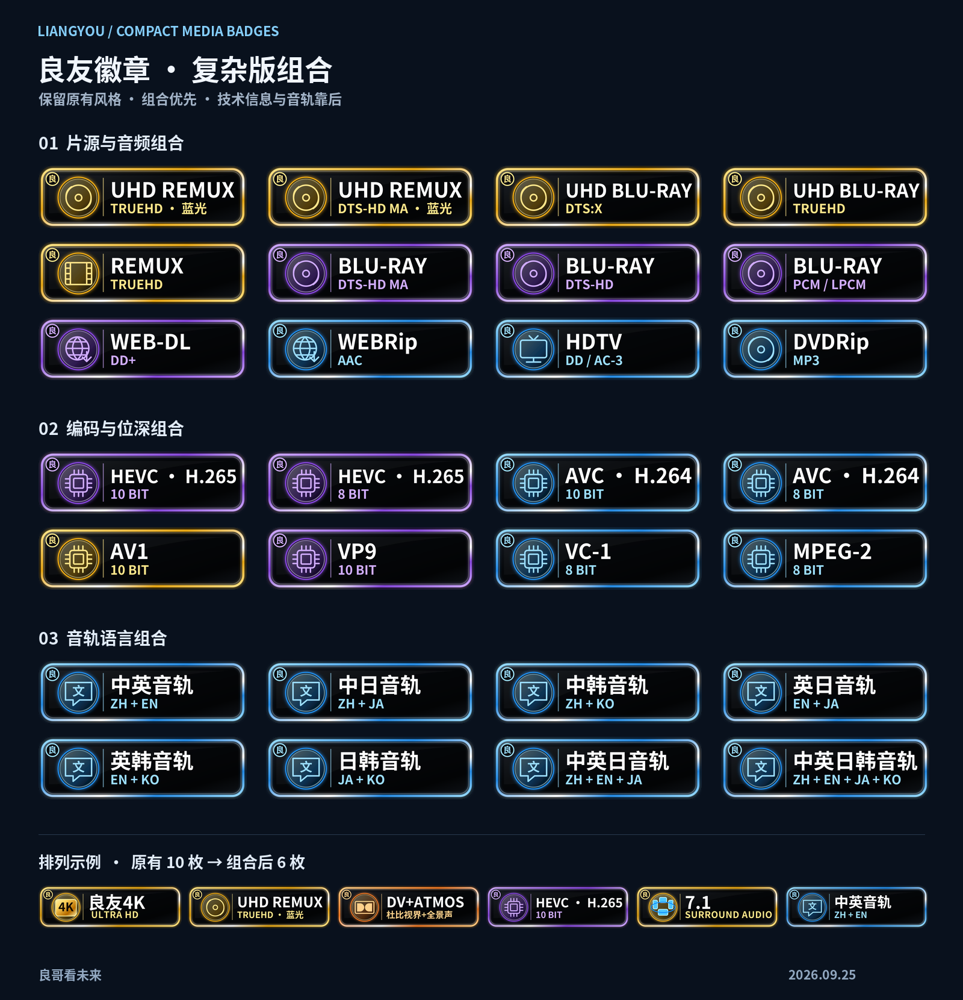

# 良友徽章 · LiangYou Media Badges

复杂版组合包 · 2026-09-25 · 良哥看未来

沿用双层发光边框、圆形图标和「良」字角标。将片源与音频格式、视频编码与位深、音轨语言合并显示，让播放界面少占位置。

## 导入复杂版

| 地址 | 用途 |
| --- | --- |
| [复杂版 all10](https://raw.githubusercontent.com/MaddestAlistar/liangyou-appletv-badges/main/Badge%20LiangYou%20Ver.all10.json) | 推荐新导入地址，避免旧配置缓存 |
| [复杂版正式地址 all](https://raw.githubusercontent.com/MaddestAlistar/liangyou-appletv-badges/main/Badge%20LiangYou%20Ver.all.json) | 已同步相同内容 |
| [原 all9 地址](https://raw.githubusercontent.com/MaddestAlistar/liangyou-appletv-badges/main/Badge%20LiangYou%20Ver.all9.json) | 已同步相同内容 |

**替换原复杂版配置后重新加载，三条地址任选一条。** 多套配置同时启用会重复显示。包内共 155 条候选规则，根据资源信息选择显示，并不是同时显示 155 枚。

## 组合预览



[全部新增图形](previews/Complex-Compact-Catalogue-v10.png) · [深浅背景预览](previews/Complex-Compact-Themes-v10.png)

新增 **78 枚组合徽章**：55 枚片源与音频、12 枚编码与位深、11 枚音轨语言组合；另有 3 枚配套单项图形。SVG 为 320×96，导入用 PNG 为 960×288，文字转为矢量轮廓，保持原徽章比例。

## 显示顺序

**良友 4K／其他分辨率 → 片源与音频组合 → 杜比与画面 → 剩余音频格式 → 版本标识 → 平台来源 → 编码与位深／帧率 → 声道 → 音轨语言。**

JSON 的规则数组和分组数组都按这个顺序排列，良友 4K 为第一条。播放器仍可能自行限制显示数量或调整排序。

| 类型 | 组合示例 | 回退方式 |
| --- | --- | --- |
| 片源与音频 | UHD Blu-ray + REMUX + TrueHD → **UHD REMUX / TRUEHD · 蓝光** | 缺音频信息时显示片源单项 |
| 片源与音频 | Blu-ray + DTS-HD MA；WEB-DL + DD+；WEBRip + AAC；HDTV + DD；DVDRip + MP3 | 少见、未提供专用组合的搭配保留两个单项 |
| 编码与位深 | **HEVC · H.265 / 10 BIT**；AVC · H.264 / 8 BIT；AV1 / 10 BIT | 缺位深时只显示编码，不猜测 8bit/10bit |
| 音轨语言 | **中英音轨、中日音轨、中韩音轨、英日音轨、英韩音轨、日韩音轨** | 只有一种已知语言时显示对应单项 |
| 多语言音轨 | 4 种三语言组合、1 种中英日韩组合 | 三／四语言不会再拆成多枚双语组合 |

HEVC 与 H.265 是同一种编码，AVC 与 H.264 也是同一种编码，别名只占一枚。颜色是本套展示风格，不代表编码或片源的绝对画质排名。

同一候选文本内，组合命中后排除对应单项，片源类别和音频格式各选择一个优先项。杜比视界与全景声仍使用原来的 DV+ATMOS 组合，中文保持「杜比视界+全景声」。TrueHD 作为片源组合的一部分，或在缺少片源时保留原金色单项。

典型完整输入 `2160p UHD BluRay REMUX DV TrueHD Atmos 7.1 HEVC 10bit 中文音轨 英语音轨`：原有效 all9 显示 10 枚，现在为 **良友4K、UHD REMUX/TrueHD、DV+ATMOS、HEVC/H.265 10bit、7.1、中英音轨**，共 6 枚。

## 识别与兼容性

基于最近实际使用的 all9（提交 `3b7745e`）制作，保留其低信息播放页回退策略与常见 dca/profile、PCM、Mono/Stereo 别名。主地址同步这一版本，避免主地址与 all9 内容不同。

- 音轨语言支持 `中文音轨`、`English audio`、`Audio: chi,eng`、`音轨：中文、英语`、`中英音轨` 等；明确字幕文本不参与语言组合。只有字幕或未知语言时，不虚构音轨。
- 音频解码的 `sample_fmt=fltp` 不能覆盖已知 AAC／DD+ 等编码；在完全没有编码信息时仍保留原 PCM 采样格式回退。
- 编码边界支持下划线文件名；DVDRip 中的 DV 不再触发 HEVC 的 Dolby Vision 回退。
- 识别 `DDP5.1`、`AAC2.0` 等紧邻写法，并排除 `Level 5.1`、`Profile 5.1` 对声道的干扰。
- 原 all9 的启发式识别继续保留：某些 DV／DD+／高规格 TrueHD 信息会推断 Atmos，部分 4K DTS 高规格信息会推断 DTS-HD MA，Main10／DV／UHD 蓝光／4K REMUX 可回退到 HEVC。这些是展示策略，不是服务器提供的确证，也不证明实际输出格式；TrueHD 本身不等于 Atmos。

**跨字段合并仍由播放器决定。** 如果播放器分别匹配「完整文件名」「TrueHD 单独字段」再合并结果，仍可能出现组合与单项并存。JSON 正则无法撤销另一条独立输入的命中，也无法拼接播放器没有传来的字段。此配置保留单项回退，避免为了全局去重而让低信息播放页全部不显示。

多音轨信息被混合传入时，组合表示资源中已知的优先格式和语言，不表示这些语言都采用同一种编码，也不等同于当前选中的音轨。本次验证未连接私人服务器或在播放器设备上运行。

## 构建与验证

```sh
python tools/compact_badges.py --render --font /path/to/NotoSansCJKsc-Bold.otf
python tools/preview_compact.py --font /path/to/NotoSansCJKsc-Bold.otf
python tools/test_compact_badges.py
```

生成器仅写入三个复杂版地址、新图形和图形清单。依赖 Python、Pillow、fontTools、lxml、Inkscape、Noto Sans CJK SC Bold；验证使用 ICU 和 Python 正则。测试直接读取交付 JSON，覆盖组合互斥、单项回退、别名、字幕排除、声道、顺序、所有图片解码和长文本性能，并保留跨字段仍可能重复的实际反例。

[验证结果](reports/compact-validation-v10.json) · [原 all9 规则快照](tools/fixtures/complex-before-compact.json)

`tools/badge_rules.py`、`render_badges.py` 的默认批量构建属于历史 V9 流程，会覆盖旧版本配置；当前复杂版请使用上面的 `compact_badges.py` 命令。历史背景、旧版本地址与 EplayerX 文档见 [V9 历史说明](reports/README-v9-historical.md)。
