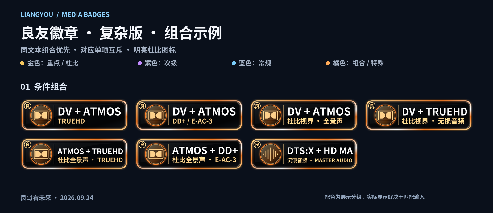

# 良友徽章 · LiangYou Media Badges

V8 · 2026-09-24 · 良哥看未来

延续原有「良」字标识、双层边框和两套图标风格，补齐常见媒体格式，修正规则误判，新增条件组合徽章。两个原有正式订阅地址继续有效。

## 导入地址

| 版本 | 内容 | 订阅 |
| --- | --- | --- |
| EplayerX | 47 枚，轻量 SVG，含 7 枚组合 | [Ver.EPX.json](https://raw.githubusercontent.com/MaddestAlistar/liangyou-appletv-badges/main/Badge%20LiangYou%20Ver.EPX.json) |
| 复杂版 | 97 枚，PNG，含 19 枚组合及 DV Profile 细分 | [Ver.all.json](https://raw.githubusercontent.com/MaddestAlistar/liangyou-appletv-badges/main/Badge%20LiangYou%20Ver.all.json) |

替换旧配置后重新加载。若客户端缓存旧 JSON，可用内容完全相同的新地址：[EPX8](https://raw.githubusercontent.com/MaddestAlistar/liangyou-appletv-badges/main/Badge%20LiangYou%20Ver.EPX8.json) / [all8](https://raw.githubusercontent.com/MaddestAlistar/liangyou-appletv-badges/main/Badge%20LiangYou%20Ver.all8.json)。同一套配置只保留一份，避免多次导入造成重复。

兼容选项：

- [EPX PNG 版](https://raw.githubusercontent.com/MaddestAlistar/liangyou-appletv-badges/main/Badge%20LiangYou%20Ver.EPX.PNG.json)：规则、图案与 EPX 一致，仅改用 PNG，可排查 SVG 解码差异。
- [复杂版仅单项](https://raw.githubusercontent.com/MaddestAlistar/liangyou-appletv-badges/main/Badge%20LiangYou%20Ver.all.Single.json)：78 枚，无组合；适用于组合与单项在客户端中同时出现的情况。
- [尺寸诊断](https://raw.githubusercontent.com/MaddestAlistar/liangyou-appletv-badges/main/Badge%20LiangYou%20Diagnostic.json)：只有一张固定测试图，临时替换正式配置后比较不同服务器的资料卡；完成后切回正式版。

EplayerX、CapyPlayer、RovePlayer、Forward、Nuvio、Rex 的具体版本和界面行为需实机验证。规则测试通过不等于已完成所有客户端兼容认证。

## 预览

[EplayerX 完整预览](previews/EPX-v8.png) · [复杂版完整预览](previews/ALL-v8.png)



## 补充与配色

两套均增加 WEBRip、UHD Blu-ray、HDTV、SDR、通用 HDR、IMAX / IMAX Enhanced、10 / 8 bit、DD+ / EAC3、DD / AC3、PCM / LPCM、OPUS、1.0 / 2.0 / 6.1。复杂版另外增加 DV P5 / P7 / P8、3D、480P / 576P、DVDRip、XviD / DivX / MPEG-2 / VC-1、MP3、50 / 60 / 120 fps、9 个平台、10 个版本标识和 4 种音轨语言。

| 边框 | 用途 | 示例 |
| --- | --- | --- |
| 金色 | 各分类的高阶项目、全部杜比单项、版本标识 | 4K、REMUX、UHD Blu-ray、DV、Atmos、TrueHD、DD+、DD、HDR10+、DTS:X、DTS-HD MA、FLAC、PCM、7.1、Director's Cut |
| 紫色 | 次级项目 | 1080P、Blu-ray、WEB-DL、HDR10、HLG、HEVC、5.1、6.1 |
| 蓝色 | 常规项目 | 720P、WEBRip、HDTV、SDR、AVC、AAC、语言、平台 |
| 橘色 | 组合及特殊项目 | DV + Atmos、DTS:X + HD MA、3D |

颜色是本套徽章的展示分级，不代表所有场景下的画质或听感排名。杜比组合使用橘色作为组合标识；杜比单项使用金色。杜比视界与全景声的双 D 图形已改为明亮填色。

暂未启用 CAM、SeaDex、True-Hue：当前缺少目标库可靠的来源标签样本；不能从片名、编码或画面观感推断这些标签。语言只识别明确的音轨语境，不将字幕标成配音；平台只按来源标签识别，不表示当前版权归属。

## 组合与去重

同一段输入文本内，组合与被其包含的单项互斥，兼容换行和标签顺序变化。

| 同一输入中的信息 | 显示组合 | 隐藏的单项 |
| --- | --- | --- |
| DV + Atmos + TrueHD | DV + ATMOS / TRUEHD | DV、Atmos、TrueHD |
| DV + Atmos + DD+，无 TrueHD | DV + ATMOS / DD+ | DV、Atmos、DD+ |
| DV + Atmos，未明确上述编码 | DV + ATMOS | DV、Atmos |
| DV + TrueHD，无 Atmos | DV + TRUEHD | DV、TrueHD |
| Atmos + TrueHD，无 DV | ATMOS + TRUEHD | Atmos、TrueHD |
| Atmos + DD+，无 DV / TrueHD | ATMOS + DD+ | Atmos、DD+ |
| DTS:X + DTS-HD MA | DTS:X + HD MA | DTS:X、DTS-HD MA |

复杂版中，明确且不冲突的 DV P5 / P7 / P8 会进入对应组合；Profile 缺失或冲突时回退到通用 DV。组合不隐藏无关音频格式。例如 `DV Atmos TrueHD EAC3` 显示三项组合，并保留额外的 DD+。

**JSON 只能处理每次传入的字符串。** NuvioTV 的已核对实现会分别匹配多个字段，再匹配合并字符串，最后取并集；因此可能同时保留组合和单项。这里的负向条件不能控制跨字段合并结果。遇到这种情况可使用「复杂版仅单项」。EplayerX 匹配器未取得公开实现，不能承诺其资料卡和播放页始终遵循同一种匹配流程。

组合表示同一资源输入里同时出现这些标签，不保证 Atmos 属于哪一条音轨，也不代表当前选中音轨或实际播放输出。若输入混合了多个媒体版本或音轨，需客户端先按当前 MediaSource / 音轨整理信息。

## 这次修正

- 修复 EPX 重复的 DTS-HD ID；区分 DTS、普通 DTS-HD、明确 MA / XLL 的 DTS-HD MA。普通 DTS-HD 使用「HD AUDIO」，不直接假定为 HRA 或 MA。
- WEBRip 与 WEB-DL 分开，平台名不再自动视为 WEB-DL。
- 修复 HDR10+ 的加号边界；兼容空格、下划线和多行信息。
- 普通 EAC3 / DD+ 不冒充 Atmos；明确 Atmos / JOC 才触发全景声。
- Main10 不单独推断 HEVC；普通 MPEG4 不单独推断 AVC。
- 避免 L5.1、Level 5.1、Profile 5.1 被当作声道；不从 6ch / 8ch 推断具体布局。
- SDR、DV Profile、位深和语言均需要明确信息；不把缺失信息当作否定证据。
- 同一输入内控制分辨率、HDR10+ / HDR10、IMAX Enhanced / IMAX、声道及 DTS 家族重复。
- 使用参考配置中常见的标准分组，不依赖未经确认的自定义排他属性。

## 显示大小与资料卡 / 播放页

原 EPX 已经是 320 × 96，尺寸差异不能简单归因于原图大小。本次所有 SVG 均统一为 320 × 96、固定比例和画布边界；所有 PNG 均为 960 × 288；文字转为矢量路径，避免字体替换改变宽度；新图片目录可避开旧资源缓存。

这些处理能减少资源本身的差异，但不能强制客户端的卡片容器高度、行数、缩放或徽章数量上限。资料卡与播放页传入字段不同，也仍可能显示不同。排查步骤和已确认的客户端限制见 [兼容性说明](reports/COMPATIBILITY-v8.md)。

## 构建与验证

源规则在 `tools/badge_rules.py`；新增图案目录在 `tools/new_badge_catalogue.json`；SVG / PNG 和预览已一并提供。历史图片和旧版实验 JSON 保留，正式地址指向 V8。

```sh
python tools/badge_rules.py
python tools/render_badges.py --font /path/to/NotoSansCJKsc-Bold.otf
python tools/test_badges.py
python tools/check_assets.py
```

生成图片需要 Python 3.12+、Pillow、fontTools、lxml、Inkscape 和 Noto Sans CJK SC Bold；匹配测试还需要 ICU 与支持源文件运行的 JDK 17+。脚本不修改历史图片目录，也不调用 Emby 接口。

474 个场景分别通过 Python、ICU 74、Java 17 Pattern，共 1,422 次结果断言。另检查全部图片尺寸、矢量文字、配置图片路径，并复现跨字段并集导致组合与单项共存的限制。[规则测试记录](reports/validation.json) · [图片检查记录](reports/assets-validation.json)。这些是自动验证，尚未取得用户设备上的实机测试结果。
