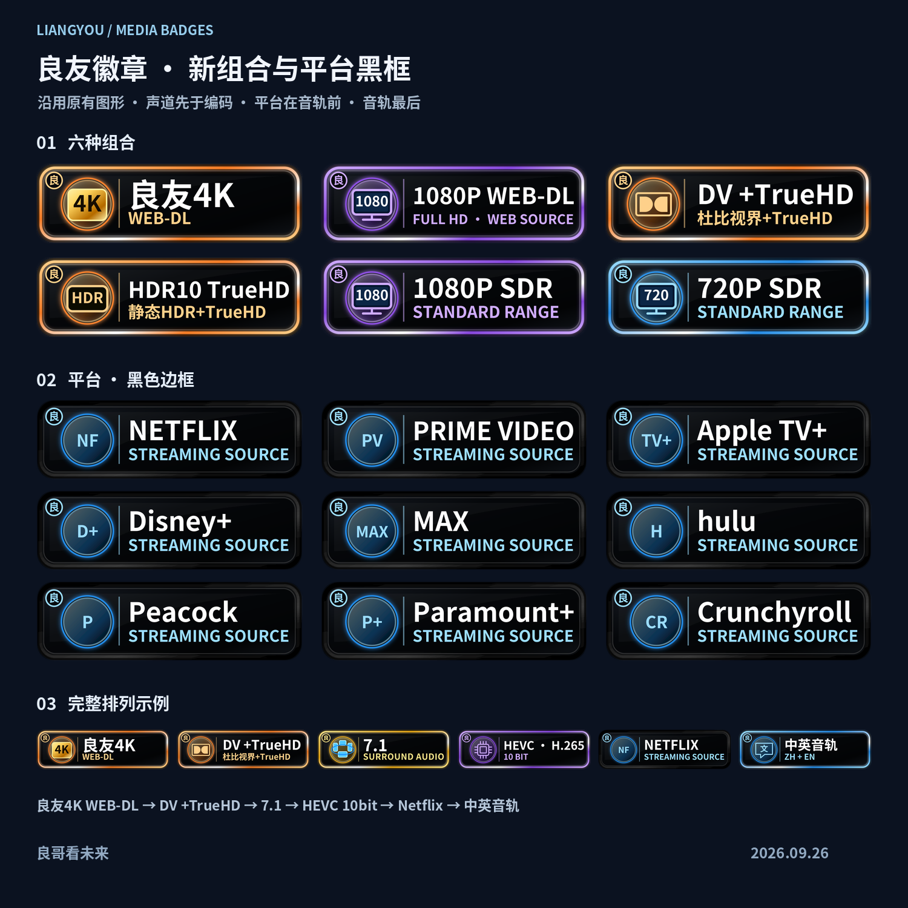

# 良友徽章 · LiangYou Media Badges

V12 · 2026-09-26 · 良哥看未来

复杂版沿用原来的发光边框、图标和「良」字角标，片源与音频、编码与位深、音轨语言合并显示。EplayerX 保留简洁造型。两版共用识别逻辑，**良友 4K 最前，7.1／5.1 等声道在 HEVC 前面**。

## 导入地址

| 版本 | 新导入地址 | 内容 |
| --- | --- | --- |
| 复杂版 | [all12.json](https://raw.githubusercontent.com/MaddestAlistar/liangyou-appletv-badges/main/Badge%20LiangYou%20Ver.all12.json) | 161 条候选规则，PNG，含组合徽章 |
| EplayerX | [EPX12.json](https://raw.githubusercontent.com/MaddestAlistar/liangyou-appletv-badges/main/Badge%20LiangYou%20Ver.EPX12.json) | 41 条候选规则，SVG，简洁造型 |
| EplayerX PNG 备用 | [EPX.PNG.json](https://raw.githubusercontent.com/MaddestAlistar/liangyou-appletv-badges/main/Badge%20LiangYou%20Ver.EPX.PNG.json) | 与 EplayerX 相同规则，完整 PNG 图片 |
| 复杂版单项备用 | [all.Single.json](https://raw.githubusercontent.com/MaddestAlistar/liangyou-appletv-badges/main/Badge%20LiangYou%20Ver.all.Single.json) | 76 条规则，保留 DV+Atmos，其余以单项显示 |

替换原徽章包并重新加载，使用所选版本的一条地址即可。新地址便于绕过旧配置缓存；同时启用多个包可能重复显示。

旧地址也已同步：复杂版 `all`、`all9`、`all10`、`all11`、`all.Relaxed` 与 `all12` 完全相同；EplayerX 的 `EPX`、`EPX9`、`EPX10.themefix`、`EPX11`、`EPX.Relaxed` 与 `EPX12` 完全相同。编号地址在本仓库是兼容入口；历史快照请使用 Git 提交链接。

## 顺序与预览

**良友 4K／其他分辨率 → REMUX 原盘组 → 普通片源 → 杜比与画面 → 剩余音频格式 → 版本 → 7.1／6.1／5.1／Stereo／Mono → 编码与位深／帧率 → 平台 → 音轨语言。**

规则数组与分组数组均采用这个顺序；播放器最终排版及显示数量由客户端决定。



[复杂版组合总览](previews/Complex-Portable-v11.png) · [全部组合图形](previews/Complex-Compact-Catalogue-v10.png) · [新组合深浅背景](previews/Complex-Themes-v12.png)

### 新增的六种组合

| 组合 | 边框 | 合成条件 |
| --- | --- | --- |
| 良友4K / WEB-DL | 橙色 | 保留良友4K 主标题，副标题由 ULTRA HD 改为 WEB-DL |
| 1080P WEB-DL | 紫色 | 1080P 与 WEB-DL 同时存在，优先于 1080P SDR |
| DV +TrueHD | 橙色 | 副标题为「杜比视界+TrueHD」；DV 没有合入 DV+Atmos，TrueHD 没有合入片源组合 |
| HDR10 TrueHD | 橙色 | HDR10 与空闲 TrueHD 同时存在；HDR10+ 不被当作 HDR10 |
| 1080P SDR | 紫色 | 同时存在 1080P 与明确 SDR，且 1080P 未合入 WEB-DL |
| 720P SDR | 蓝色 | 同时存在 720P 与明确 SDR |

分辨率＋WEB-DL 已占用来源时，不再重复显示 WEB-DL＋音频组合，对应音频保留单项或进入其他有效组合。没有明确 SDR 不推断 SDR。六种新组合用于复杂版，单项备用版和 EplayerX 保留各自图形集。

Netflix、Prime Video、Apple TV+、Disney+、Max、Hulu、Peacock、Paramount+、Crunchyroll 共九种平台徽章改成黑框。平台分组紧接音轨语言之前；没有音轨语言时，平台位于已匹配列表末尾。原有平台图标与文字保留。

复杂版保留 55 枚片源与音频组合、12 枚编码与位深组合、11 枚多语言音轨组合，以及 3 枚配套单项图形。SVG 为 320×96，PNG 为 960×288，文字已转轮廓。候选规则不会全部同时显示。

完整输入 `2160p UHD BluRay REMUX DV TrueHD Atmos 7.1 HEVC 10bit 中文音轨 英语音轨` 显示：

**良友4K → UHD REMUX / TrueHD → DV+Atmos → 7.1 → HEVC·H.265 / 10bit → 中英音轨**，共 6 枚。

HEVC 与 H.265、AVC 与 H.264 各合为同一种编码。没有位深信息时保留编码单项；不凭空补 8bit 或 10bit。稀少、没有专用组合图形的片源与音频搭配保留两个单项。

## 本次排查与同步

V10 复杂版存在大量 `\A`／`\Z` 锚点，ECMAScript 模式下会失效；EplayerX 主地址仍是旧的严格上下文版，会漏掉独立播放字段。V11 已移除这些锚点、恢复低信息单项回退。V12 延续此修复并补充音频元数据与新组合；当前复杂版最长规则为 **12,337** 字符，主 JSON 约 **0.70 MB**（V10 为 1.56 MB）。语言组合需要分别检查四类语言，规则因此较 V11 增长，已进行跨引擎及长文本测试。

这复现了能造成大量徽章不显示的兼容性问题；截图本身未提供播放器真实匹配输入，不能据此确认设备端只有这一种原因。测试保留已有 `(?i)` 配置前缀，在 Node 中将其映射为 `i` 标志；未声称配置可未经导入器处理就直接交给 JavaScript `RegExp`。

| 项目 | 两版公共规则 |
| --- | --- |
| REMUX | 独立 `master-source` 高优先级组，排在普通片源前 |
| UHD Blu-ray／Blu-ray／WEB-DL | 同一输入内按优先级互斥，REMUX 与蓝光来源可以同时表达；复杂版的 UHD REMUX 徽章已经合并二者，避免再补一枚相同来源 |
| Atmos | 明确 Atmos／JOC、连写标记、正值 Atmos 标志及 TrueHD 16-ch 特征优先；按使用需求保留 **DV + DD+ 5.1／7.1** 的兼容推断，普通 DDP5.1、4K DDP5.1、单独 DDP7.1 不推断 Atmos |
| DD+ | Atmos 命中时让位，包括含 DD+ 的片源组合；片源本身仍保留 |
| DTS | 两版识别 `dca`、`profile=ma/xll/hra/x`；**取消仅凭 4K／DV／UHD／REMUX 推断 DTS-HD MA**，缺具体 profile 时保留 DTS |
| PCM | 识别 `A_PCM/…`、`pcm_f32le`、`pcm_s24le`、`sowt` 等明确编码；**取消仅凭解码 `sample_fmt=fltp/s16/…` 推断 PCM** |
| Mono／Stereo／环绕声道 | 支持 `1ch`、`2ch`、`channels=1/2` 等；声道排在编码前，排除视频 `Level/Profile 5.1`，不把 `channels=20` 当 2.0 |
| WEB-DL | 支持 WD、NF、AMZN、DSNP、ATVP 等来源缩写回退；明确 WEBRip 优先于平台缩写回退，明确 WEB-DL 仍优先于 WEBRip |

同时修正了 `pcm_bluray` 编码 ID 被误当作蓝光来源、`WEB-Rip` 被误当作 WEB-DL 等边界情况。EplayerX PNG 备用包补齐 41 张与当前 SVG 对应的图片。

保留的兼容推断仍有边界：DV + DD+ 5.1／7.1 不等于服务器确认了 Atmos；Main10／DV／UHD 蓝光／4K REMUX 在没有相冲突编码时可回退 HEVC；平台缩写可回退 WEB-DL。这些展示策略不证明播放设备实际输出格式，也不是画质排名。

## Atmos 与音轨漏识别修复

旧规则漏掉 `TrueHD7.1Atmos`、`DDP5.1Atmos`、`EAC3JOC` 等无分隔符写法，以及部分 Language 字段和音轨显示标题。V12 已补齐这些入口，也识别 TrueHD／MLP FBA 加 16-ch 特征、正数动态对象计数和明确的 `IsAtmos=true`／`HasAtmos=true`。普通 TrueHD7.1、DDP5.1、4K 本身仍不推断 Atmos；明确 False 不作为正值线索，且阻止弱 DV＋DD+ 推断。

语言规则按 Audio／Subtitle 对象及媒体信息分段检查，避免英语音轨＋日语字幕变成英日双语。粤语归入现有中文音轨徽章；字幕中的“中英双语”和任意电影文件名中的 CHS／ENG 不被盲目当作音轨。

这些是规则级可复现的漏匹配；没有取得用户设备真实候选字段，不能断言所有服务器都采用同一输入方式。如果播放页没有传入语言，或只传来不含 Atmos 标记的普通编码，本配置无法恢复缺失元数据。详见 [V12 修复说明](reports/AUDIO-AND-COMBOS-v12.md)。

## 资料卡与播放字段

单独传入 `4K`、`HEVC`、`WEB-DL`、`BluRay Remux`、`HDR`、`SDR`、`5.1` 等都有对应回退；完整文件名和具有同样事实的合并播放字段得到一致结果。

复杂版音轨语言补充 `Language=eng`、`English - TrueHD - 7.1`、`中文 / English`、`中英双语`、语言地区代码、粤语／Cantonese／yue、繁体写法和同一 Audio 对象里的 Language 字段。支持 `中文音轨`、`English audio`、`Audio: chi,eng` 等；双／三／四语言各只显示对应的一枚组合，不把明确字幕语言当音轨。EplayerX 保持现有精简图形集，公共标签使用相同规则。

**跨字段合并由播放器决定。** 若客户端分别匹配完整文件名、独立编码、独立语言字段，再将结果取并集，组合与单项仍可能共存。JSON 不能撤销另一条输入的命中，也不能取得播放器没有传入的字段。测试保留了这个反例，没有以禁用单项回退的方式隐藏它。

多音轨被混合传入时，徽章表示资源中已知的优先格式与语言，不等同于当前选中的音轨。未连接私人服务器或在播放器设备上运行。

## 构建与验证

```sh
python tools/portable_badges.py
python tools/portable_badges.py --render-epx-png  # 重新生成 EplayerX PNG，需要 Inkscape
python tools/test_portable_badges.py
python tools/v12_badges.py --font /path/to/NotoSansCJKsc-Bold.otf
python tools/preview_v12.py --font /path/to/NotoSansCJKsc-Bold.otf
```

479 个场景 × 4 个交付变体 × 3 个引擎，共 **5,748 次完整结果对比**通过。Python re、ICU、Node ECMAScript 覆盖独立字段、组合回退、来源／音频互斥、排序、别名、误判反例和长文本；245 个不同图片 URL 对应的本地资源全部存在并通过解码／SVG 检查。验证是配置级测试，不是实机认证。

规则构建只依赖 Python；测试还需 Node、ICU、Pillow、lxml；预览需字体与 Pillow。`compact_badges.py` 和 `badge_rules.py` 的默认配置写入入口已转向 V12，避免旧构建命令重新覆盖修复。V10 图形仍由 `compact_badges.py --render --font …` 维护；历史 V9 渲染器与测试只用于旧图形／旧规则研究。

[V12 验证报告](reports/portable-validation-v12.json) · [兼容性复盘](reports/COMPATIBILITY-v11.md) · [V11 历史说明](reports/README-v11-historical.md) · [V10 历史说明](reports/README-v10-historical.md) · [V9 历史说明](reports/README-v9-historical.md)
